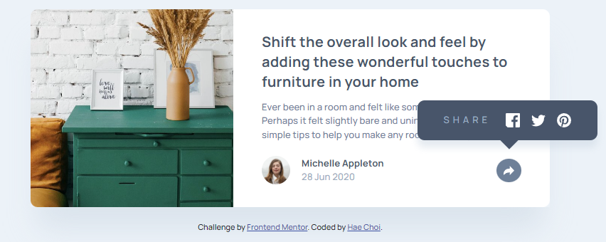
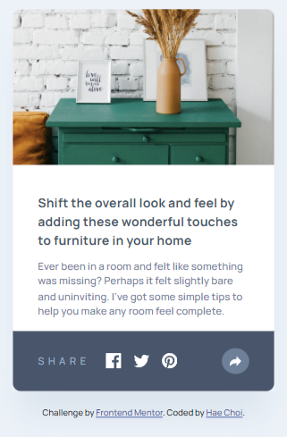

# Frontend Mentor - Article preview component solution

This is a solution to the [Article preview component challenge on Frontend Mentor](https://www.frontendmentor.io/challenges/article-preview-component-dYBN_pYFT). Frontend Mentor challenges help you improve your coding skills by building realistic projects.

## Overview

### The challenge

Users should be able to:

- View the optimal layout for the component depending on their device's screen size
- See the social media share links when they click the share icon

### Screenshot

## My process

### Built with

- Semantic HTML5 markup
- CSS custom properties
- Flexbox
- CSS Grid
- Vanilla JS

### What I learned

- Setting an image as a background image within a container does give you more flexibility.
- Aligning two div containers as grid child elements so that both have identical heights may require explicitly stretching.
  - If aligning an image it is best to put it within a container first.
- If a button contains an important icon it is best to title it using the name attribute for screen reading.
- Webkit transition is deprecated.
- If toggling `display: none` it must be that in the css the mentioned display must come last of after its original element.
- `window.matchMedia("(max-width: 726px)").matches` is a way to set a conditional based on screen width in js.

### Features to consider adding

- Exit popups when user clicks anywhere outside the appropriate btn or when user hits the esc key.
- When user changes to any both viewport modes, automatically exit popup.

### Useful resources

- [Resource 1](https://techstacker.com/javascript-detect-if-screen-width-is-greater-or-less-than/)
- [Resource 2](https://stackoverflow.com/questions/68080246/cant-change-color-of-svg-to-white) - How to change fill color.
- [Resource 3](https://markheath.net/post/font-awesome-circle-background) - How to create round bg color for icons.
- [Resource 4](https://raddy.dev/blog/fade-in-fade-out-animation-in-javascript-and-css/)

## Author

- Frontend Mentor - [@dagimchi](https://www.frontendmentor.io/profile/dagimchi)
- Twitter - [@dagimchi](https://www.twitter.com/dagimchi)

## Acknowledgments

https://article-preview-component-solution.vercel.app/

- How to create a bubble tail shape
